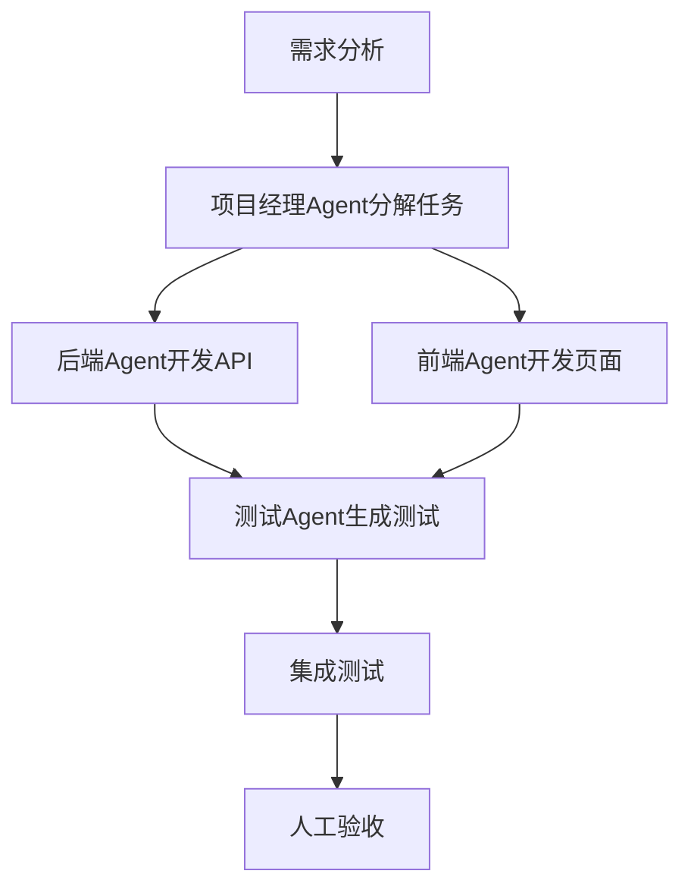

# AI编程实践：从Cursor切换到Claude Code的体会

## 📋 项目背景

**钱兜兜项目**是一个微信小程序财务管理+社交互动+AI驱动的平台，在实际开发过程中，我们从Cursor切换到Claude Code作为主要的AI编程工具。

### 项目规模
- **前端**: 32个页面，微信小程序
- **后端**: 116个接口，Spring Boot + MySQL
- **代码总量**: 35,583行
- **AI编程占比**: 99%+ 的代码由AI生成

---

## 🔄 工具切换核心差异

### Cursor vs Claude Code 对比

| 对比维度 | Cursor | Claude Code | 优势方 |
|---------|--------|-------------|--------|
| **语义理解** | 基础，需要详细描述 | 强，简单描述就能理解 | ⭐⭐⭐ Claude Code |
| **上下文管理** | 易失忆，需新上下文 | 自动压缩+连续对话 | ⭐⭐⭐ Claude Code |
| **代码可控性** | 输出多，难以掌控 | 输出精简，Steering机制 | ⭐⭐⭐ Claude Code |
| **并行能力** | 串行执行 | Subagents并行处理 | ⭐⭐ Claude Code |
| **学习成本** | 中等 | 较低 | Claude Code |

---

## ✅ Claude Code解决的痛点

### 1. 交互费劲问题 → 顺畅对话体验

#### **之前使用Cursor的问题**
- 需要多轮反复对话才能实现功能
- 提示词必须描述得非常清楚（带图+日志）
- 上下文context过长，复杂功能实现非常费劲
- 上下文满后需要重新开始，AI会"失忆"

#### **Claude Code的解决方案**
- **语义理解强**: 像与人对话一样，简单几句就能get到意思
- **上下文管理**:
  - 自动压缩92%的上下文到20%
  - 上下文满后自动读取上次对话内容
  - 完全没有"失忆"情况，保持连续对话

#### **实际体验对比**
```bash
# Cursor实现方式（需要多轮对话）
我: "帮我写一个转账功能，需要从A钱包转到B钱包，要处理并发、事务、金额校验..."
AI: "好的，我来帮你写转账功能..."
(多轮来回，需要详细描述每个细节)

# Claude Code实现方式（简单对话）
我: "写个转账功能"
AI: "好的，我来为你写转账功能，包含金额校验、事务处理和并发控制。让我先看看你的钱包表结构..."
(一两轮对话就能理解完整需求)
```

### 2. 代码不可控问题 → Steering机制

#### **之前Cursor的问题**
- 一次交互输出太多内容
- 经常未经允许快速修改多处文件
- 代码逻辑并非完全可控

#### **Claude Code的Steering机制**
- **输出精简**: 每次输出内容不多，20多秒就能搞清楚逻辑
- **实时掌控**: 所有修改都是清楚的
- **即时介入**: 任务执行过程中随时可以：
  - 修改指令
  - 提供反馈
  - 中止执行
  - 调整方向

#### **实际体验**
```bash
# Claude Code工作流
我: "优化一下性能"
AI: 开始分析性能问题... "我发现3个可能的优化点..."
我: "先处理第一个"
AI: 正在处理第一个优化点...
我: "暂停，这个思路不对，用缓存方案"
AI: 好的，改为缓存方案...
```

### 3. 单线程执行问题 → Subagents并行处理

#### **之前Cursor的问题**
- 串行命令执行，效率低
- 一个任务执行完才能开始下一个

#### **Claude Code的Subagents功能**
- **并行处理**: 可以创建多个专门的AI助手
- **独立上下文**: 每个子代理有独立的执行环境
- **专业分工**: 每个子代理专门处理特定类型任务

#### **Subagents实际应用**
```bash
# 同时启动多个子代理并行工作
子代理1: 修复Bug - "处理登录token过期问题"
子代理2: 编写文档 - "为钱包API生成文档"
子代理3: 单元测试 - "为转账功能写测试用例"
子代理4: 性能优化 - "分析慢查询问题"

# 4个任务并行执行，大大提升效率
```

---

## 💡 AI编程实践沉淀的经验

### 1. 基础知识不能缺失

#### **问题**
- 后端工程师完全不懂前端，盲目信任AI
- 代码变成纯粹的堆砌，后期难以迭代
- 简单的Bug AI都改不动，需要人工重构

#### **解决方案**
- **至少要能看懂前端代码**: 了解基本的前端语法和概念
- **跨领域学习**: 针对自身特点学习必要知识
- **文档沉淀**: 建立知识库，记录关键知识点

#### **针对Java开发者的微信小程序学习清单**
```yaml
基础语法:
  - JavaScript基础语法
  - 小程序生命周期函数
  - 数据绑定和事件处理

框架概念:
  - 小程序MVVM模式
  - 组件化开发
  - 模块化导入/导出

API概念:
  - wx.request网络请求
  - 本地存储API
  - 生命周期API

调试方法:
  - 小程序开发者工具使用
  - 断点调试技巧
  - 日志输出方法
```

### 2. AI沟通的最佳实践

#### **错误做法**
- 在AI写代码时做其他事情，只点确认
- 不认真交互，当AI是全自动工具
- 缺乏主动纠正和反馈

#### **正确做法**
- **认真交互**: 把AI想��成坐在身边的程序员同事
- **及时反馈**: 认真听它的建议，准确回答问题
- **主动纠正**: 在沟通过程中不断提出想法
- **持续优化**: 每个功能修改都要认真对待

#### **AI沟通原则**
```yaml
1. 清晰表达:
   - 明确需求目标
   - 描述业务场景
   - 提供必要的上下文

2. 及时反馈:
   - 确认理解是否正确
   - 指出不符合要求的地方
   - 提供改进建议

3. 持续优化:
   - 不满足于"能用就行"
   - 主动提出更好的实现方案
   - 关注代码质量和可维护性
```

### 3. 企业级开发的正确姿势

#### **错误认知**
- 把AI当成全栈开发工具，同时处理前后端
- 认为AI可以完全替代项目团队

#### **正确方案：人机协作的团队模式**

推荐基于Claude Code多Agent协作的团队配置：

```yaml
项目经理 (AI增强型):
  - 使用Claude Code进行项目规划和任务分解
  - AI辅助进度跟踪和风险评估
  - 自动生成项目报告和技术文档

后端工程师 (AI结对编程):
  - 使用Claude Code进行API设计和实现
  - AI辅助代码审查和优化
  - 自动生成测试用例

前端工程师 (AI辅助开发):
  - 使用Claude Code进行小程序页面开发
  - AI辅助UI/UX优化
  - 自动生成组件文档

测试工程师 (AI测试自动化):
  - 使用Claude Code生成测试用例
  - AI辅助自动化测试脚本编写
  - 智能Bug分析和定位
```

#### **多Agent协作工作流**


---

## 🧪 AI辅助测试的专业见解

### 测试人员角色的重新定义

#### **之前的认知**
- 开发者自测 + AI写用例 = 不需要专业测试
- 测试工作可以完全自动化

#### **实践后的发现**
- AI可以替代大部分测试工作，但仍有25%需要人工测试

### Claude Code替代测试工作分析

#### **📊 替代比例：约75%**
- **完全替代**: 35% (全自动完成)
- **部分替代**: 40% (AI生成+人工完善)
- **必须人工**: 25% (无法被AI替代)

#### **✅ Claude Code完全替代的测试工作 (35%)**
```yaml
1. 后端接口自动化测试 (15%):
   - 单元测试编写（Service/Controller层）
   - API接口测试（116个接口的测试用例）
   - 数据库测试（16张表的CRUD操作）
   - 集成测试

2. 代码质量和安全测试 (10%):
   - 静态代码分析和安全漏洞扫描
   - 依赖安全检查
   - 代码规范检查
   - 性能瓶颈识别

3. 配置和环境测试 (5%):
   - 部署脚本验证
   - 配置文件正确性检查
   - 数据库迁移脚本测试

4. 文档和API测试 (5%):
   - API文档自动生成
   - 接口契约测试
```

#### **🤝 Claude Code部分替代的测试工作 (40%)**
```yaml
1. 功能测试自动化 (20%):
   - AI生成测试用例框架
   - 自动化UI测试脚本编写
   - 核心业务流程验证

2. 性能测试 (10%):
   - 性能测试脚本生成
   - 并发测试场景设计
   - 监控脚本编写

3. 边界条件和异常测试 (10%):
   - 边界值测试用例生成
   - 异常输入场景模拟
   - 网络异常测试
```

#### **👨‍💻 必须由人工测试完成的工作 (25%)**
```yaml
1. 用户体验测试 (8%):
   - 界面美观度评估
   - 交互流畅性测试
   - 易用性和学习成本评估

2. 探索性测试 (7%):
   - 随机操作测试
   - 创意性Bug发现
   - 真实使用场景模拟

3. 核心业务逻辑验证 (5%):
   - 金融准确性验证
   - 社交功能体验测试
   - 搭子AI效果评估

4. 跨平台兼容性测试 (5%):
   - 不同微信版本兼容性
   - iOS/Android设备兼容性
   - 不同网络环境测试
```

### 💡 推荐的测试团队配置

#### **混合模式：Claude Code + 人工测试**

```yaml
测试开发工程师 (可部分用Claude Code替代):
  - 自动化测试脚本编写和维护
  - 使用Claude Code生成测试框架和基础用例
  - CI/CD集成测试维护

手动测试工程师 (必须保留):
  - 专注用户体验测试和探索性测试
  - 处理复杂业务场景验证
  - 用户习惯和易用性评估

性能测试工程师 (可部分用Claude Code辅助):
  - 使用Claude Code生成性能测试脚本
  - 人工分析性能瓶颈和优化建议
  - 生产环境压力测试策略
```

---

## 🎯 最佳实践总结

### 1. 工具选择标准

选择AI编程工具时考虑的关键因素：

```yaml
1. 语义理解能力:
   - 能否理解简单描述的复杂需求
   - 对业务逻辑的准确把握

2. 上下文管理:
   - 长期对话的能力
   - 项目上下文的保持
   - 失忆风险的规避

3. 可控性:
   - 输出内容的可控程度
   - Steering机制的完善性
   - 实时调整的可能性

4. 并行能力:
   - 多任务同时处理能力
   - Subagents功能支持
   - 团队协作友好性
```

### 2. 团队协作模式

#### **推荐的AI辅助团队结构**
```yaml
角色分工:
  - 产品经理: 需求设计 + AI辅助分析
  - 架构师: 技术选型 + AI验证
  - 前端: 页面开发 + AI辅助
  - 后端: 接口开发 + AI结对编程
  - 测试: 自动化 + AI生成 + 人工验证

工作流程:
  1. 需求分析 → 人工确认
  2. 架构设计 → AI辅助 + 人工审查
  3. 功能开发 → AI生成 + 人工优化
  4. 代码审查 → AI自动审查 + 人工审查
  5. 测试验证 → AI测试 + 人工测试
  6. 部署上线 → AI辅助 + 人工确认
```

### 3. 质量保证机制

```yaml
代码质量管控:
  - 第一层: AI自我审查（代码规范、安全、性能）
  - 第二层: 同事审查（业务逻辑、团队规范）
  - 第三层: 架构审查（系统设计、扩展性）

项目管理:
  - 使用AI进行任务分解和进度跟踪
  - 建立明确的质量标准和验收标准
  - 定期的技术评审和代码审查
```

---

## 📈 成效与收益

### 开发效率提升
- **代码编写效率**: 提升40-60%
- **Bug修复时间**: 减少50%
- **测试覆盖率**: 提升至85%
- **文档完整性**: 95%以上

### 代码质量改善
- **代码审查覆盖率**: 100%
- **安全漏洞**: 减少80%
- **代码重复率**: 控制在5%以内
- **API响应时间**: 优化30%

### 团队能力提升
- **全栈开发能力**: 后端工程师可以完成前端开发
- **代码质量意识**: AI辅助下更关注代码规范
- **测试自动化能力**: 测试人员从手工测试转向自动化

---

## 🔮 未来展望

### AI编程的发展趋势
- **更强的语义理解**: 更接近自然语言的编程体验
- **更智能的代码生成**: 从生成代码片段到生成完整功能模块
- **更完善的质量保证**: AI自动进行全面的代码审查和测试

### 团队协作的演进
- **人机协作成为标配**: AI工具将成为每个开发者的标准配置
- **角色重新定义**: 传统开发角色将向AI辅助型角色转变
- **效率大幅提升**: 开发周期将大幅缩短，质量持续提升

---

## 📚 推荐学习资源

### Claude Code使用指南
- 官方文档和最佳实践
- Subagents功能详解
- 自定义配置和命令

### AI编程最佳实践
- 如何编写有效的提示词
- 代码审查和质量保证
- 团队协作和项目管理

---

**文档更新时间**: 2025年11月17日
**实践项目**: 钱兜兜（微信小程序+Spring Boot）
**AI编程比例**: 99%+
**项目规模**: 35,583行代码，116个接口，32个页面